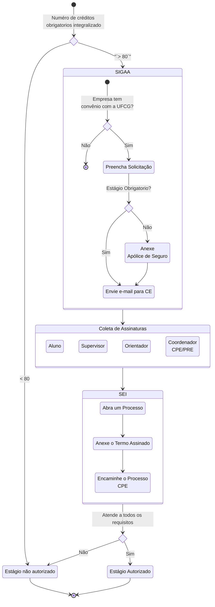

# Tutorial para Formalização de Estágio na UFCG

## Requisitos para Iniciar o Estágio

1. **Créditos e Matrícula:**
   - O aluno precisa ter integralizado **80 créditos** do Núcleo de Conteúdos Obrigatórios.
   - Deve estar **matriculado** em alguma disciplina, idealmente apenas em TCC.
   - Não pode ter integralizado todos os créditos necessários para a formatura.
   
2. **Carga Horária:**
   - A carga horária mínima é de **300 horas**.
   - O estágio deve ter duração de pelo menos **4 meses**.
   - A carga horária máxima de atividades acadêmicas (soma da carga horária das disciplinas, estágio, projetos, etc) não deve exceder 50 horas por semana.

3. **Outros Requisitos:** 
    - Se o estágio for fora de Campina Grande:
        - Se for dentro do estado: o aluno deve comprovar que há compatibilidade entre os horários de trabalho e os horários das disciplinas presenciais nas quais está matriculado. Deve-se considerar o tempo de deslocamento, alimentação, etc. Em alguns casos, o coordenador de estágio pode solicitar uma declaração da empresa atestando o horário de trabalho do estagiário.
    - Se for fora do estado: o aluno não poderá estar matriculado em disciplinas presenciais, apenas em TCC. Ou seja, se você pretende fazer um estágio fora do estado no final do seu curso, planeje-se para estar matriculado apenas em TCC no seu último período.

4. **Requisitos da PRE** : 
    - Veja nesta [página](https://pre.ufcg.edu.br/pre/estagios-e-convenios?showall=&start=1) mantida pela PRE outras possíveis restrições que podem impactar a realização do seu estágio.

## Passos para Formalização do Estágio

### Passo 1: Elaborar o Plano de Estágio

- Verifique se a instituição dispõe de um supervisor técnico.
- Elabore o plano de estágio juntamente com seu supervisor e orientador.

### Passo 2: Registro do Plano de Estágio

Acesse o sistema de SIGAA e siga as instruções do [manual](https://portal.pre.ufcg.edu.br/phocadownload/SIGAA/Manual-SIGAA-modulo-estagio-discentes.pdf) da PRE.

Resumo:
1. Encontre a aba Minhas Informações e selecione Estágios
1. Preencha o plano de atividades de estágio.
    1. Escolha uma concedente cadastrada digitando seu CNPJ no campo adequado.
    1. Indique se o Estágio é Obrigatório ou não.
    1. Preencha os campos necessários.
    1. Indique o orientador de estágio.
1. Após a aprovação do plano de atividades pelo orientador será feita a análise para a emissão do termo de compromisso.
    1. A análise é realizada pela Coordenação de Estágios da Unidade Acadêmica de Sistemas de Computação.
    1. Caso o plano de atividades seja rejeitado, você pode editar um novo plano.

### Passo 3: Assinatura do Termo de Estágio

Uma vez aprovado, o termo de compromisso será impresso em quatro vias que devem ser assinadas pela CPE ou pela Direção, pelo representante legal da concedente, pelo aluno e pelo professor orientador.

- Abra um processo no sistema SEI! requisitando a assinatura do representante da UFCG (CPE/UFCG).

Após colher as assinaturas, o aluno deve entregar as vias no setor competente para celebração do termo, o que marca o início formal do Estágio.

### Passo 4: Envio do Processo

- Envie o número do processo por e-mail para o Coordenador de Estágio da UASC.
- Certifique-se de atender a todos os pré-requisitos antes do encaminhamento.

## Conclusão do Estágio

- Após a avaliação, que dura aproximadamente **30 dias**, você receberá um certificado de conclusão.
- Um relatório bem escrito é fundamental para a aprovação.

## Observações Importantes

- Entre o início do estágio e a assinatura do termo de compromisso, é permitida uma tolerância de **20 dias corridos**.

Para mais detalhes, consulte o coordenador de estágio.
