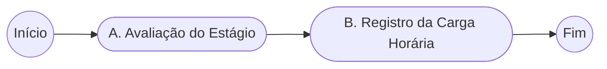
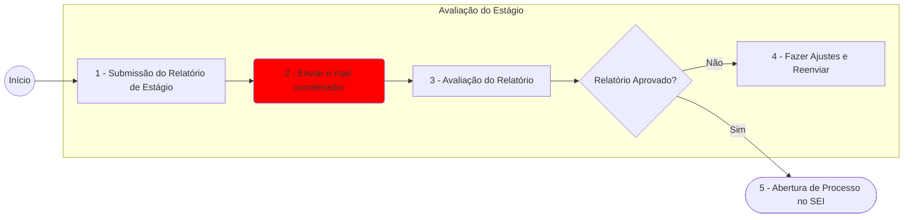
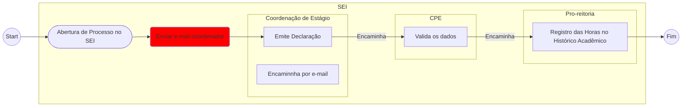

## Procedimentos para Estágios Gerenciados pelo SIGAA

Para concluir seu estágio pelo **SIGAA**, é necessario passar por duas etapa distintas, ilustradas no fluxoo grama abaixo:

Na etapa de [Avaliação do Estágio](#avaliação-do-estágio) o(a) discente deve realizar o depósito dos elementos avaliativos do estágio no SIGAA. Após essa etapa, é necessário utilizar o SEI para solicitar [Registro da Carga Horária](#registro-da-carga-horária) do estágio. As seções abaixo detalham o passo a passo de cada etapa..

> ⚠️ **Leiam com atenção, para evitar contratempos.**

### Avaliação do Estágio

Nesta etapa o discinete deve submeter o relatório de estágio para avaliação, lembre-se que **`notificar o coordenador por e-mail (Passo 3)`** informando que **todos os elementos** foram preenchidos e ja podem ser avaliados. A figura abaixo ilustra todos os passos dessa etapa.

Nesta etapa, o discente deve submeter o relatório de estágio para avaliação (`passo 1`). O(a) disciente deve **notificar o coordenador por e-mail**, pois o SIGAA não notifica automaticamente a coordenação, assim que todos os elementos do processo estiverem devidamente preenchidos, pois somente após essa notificação a avaliação será iniciada. A figura abaixo ilustra o fluxo de atividades que compõem esta etapa.

> **É importante lembrar que o seu trabalho só será avaliado se você notificar a coordenação**, pois o SIGAA não possui a função de envio automático de notificações.

No SIGAA, há um formulário disponível que reúne diferentes partes do processo de avaliação, sumárizados abaixo:

1. **Perguntas sobre o estágio** – Você descreverá aspectos importantes sobre suas atividades, responsabilidades e aprendizado.
2. **Autoavaliação** – Você atribuirá notas a diferentes competências, como pontualidade, iniciativa e relacionamento com a equipe.
3. 📌 **Relatório de Estágio** – Documento que deve ser revisado e assinado digitalmente pelo seu orientador acadêmico antes de ser anexado.
    - Lembrando que não ha modelo para o relátorio de estágio
    - 🔏📝 Este documento deve ser assinado, para mais informações de como assinar veja o [link](../assinaturas.md)
4. 📌 **Avaliação do Supervisor** – Formulário que deve ser preenchido e assinado pelo seu supervisor técnico e anexado ao processo.
    - [📄 Formulário de Avaliação do Supervisor](formularios/avaliacao_supervisor.pdf)
    - 🔏📝 Este documento deve ser assinado, para mais informações de como assinar veja o [link](../assinaturas.md)

> **⚠️ Antes de iniciar o preenchimento do formulário no SIGAA**, certificar-se de que todos os documentos obrigatórios já estão prontos. Isso inclui o termo de compromisso, o relatório revisado e assinado, autoavaliação e a avaliação do supervisor. Dessa forma, o processo de submissão ocorrerá de forma mais ágil;

### Registro da Carga Horária

Para que as horas de estágio sejam devidamente registradas no histórico acadêmico, o estudante deve abrir um processo no SEI do tipo **“Graduação: Programas de Estágio Não Obrigatório”**, endereçado à **CE/UASC**. Nesse processo, é necessário anexar todos os documentos obrigatórios: 

1. Termo de Compromisso de Estágio gerado no SIGAA
2. Relatório de estágio assinado digitalmente, 
3. Avaliação do supervisor técnico e a autoavaliação preenchida no sistema.

Uma vez aberto o processo e anexados os documentos, o(a) estudante **deve notificar o coordenador de estágio por e-mail para que a tramitação siga corretamente**. Após a notificação, a coordenação de estágio emite a declaração correspondente e a encaminha para a CPE, responsável por validar os dados. Em seguida, a documentação validada é remetida à Pró-Reitoria, que realiza o registro oficial das horas no histórico acadêmico do aluno.  

Ao final do processo, o(a) estudante terá as horas do estágio não obrigatório devidamente computadas em seu histórico acadêmico.
