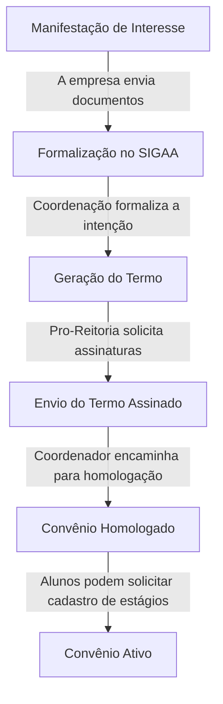

# Orientação para Cadastro de Novo Convênio com uma Empresa

Para cadastrar um novo convênio com uma empresa, siga os passos abaixo:

## Passos para Cadastro do Convênio

1. **Manifestação de Interesse**:
    
> - A empresa manifesta interesse em estabelecer um convênio através de e-mail, enviando os documentos necessários:
>    - [Empresa](#dados-da-empresa)
>    - [Responsável da Empresa](#dados-do-responsável)
>    - [Supervisor do Estágio](#dados-do-supervisor)
> - Certifique-se de que todos os documentos necessários foram enviados e que o processo está sendo acompanhado adequadamente.

2. **Formalização no SIGAA**:
>   - A coordenação formaliza a intenção de convênio no sistema SIGAA.

3. **Geração do Termo**:
>   - A Pro-Reitoria gera o termo de convênio e solicita a coleta de assinaturas da empresa, que deve ser realizada pela coordenação.

4. **Envio do Termo Assinado**:
>   - A empresa envia o termo assinado para o coordenador, que então encaminha o processo para homologação do convênio.

Com o convênio ativo, os alunos já podem solicitar o cadastro de estágios.

## Dados para serem enviados

Dados e documentos para serem enviados para a coordenação de estágio:

### Dados da Empresa
- CNPJ
- Nome
- Nome de Fantasia
- CEP
- Logradouro
- Bairro
- Complemento
- UF
- Município

A empresa precisa enviar os seguintes **Documentos**:
- **CPF/CNPJ**
- **Contrato Social**

### Dados do Responsável

- CPF:
- Nome:
- RG:
- Órgão de Expedição:
- UF:
- Cargo:
- E-mail:

A empresa precisa enviar os seguintes **Documentos** do Responsável:

- **RG**:
- **CPF**:

### Dados do Supervisor

- CPF:
- Nome:
- RG:
- Cargo:
- E-mail:

## Contato

Em caso de dúvidas, entre em contato com o setor responsável pelo cadastro de convênios através do e-mail <thiagonobrega@computacao.ufcg.edu.br>
<!-- ou pelo telefone (XX) XXXX-XXXX. -->
