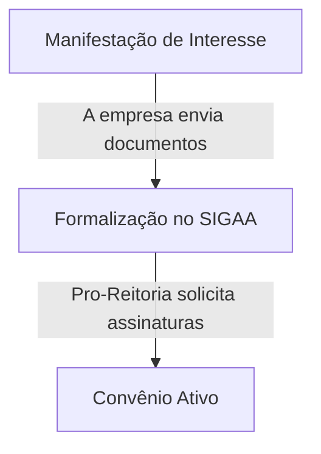

# Orientação para Cadastro de Novo Convênio com uma Empresa

Para cadastrar um novo convênio com uma empresa, siga os passos abaixo:

## Passos para Cadastro do Convênio

1. **Manifestação de Interesse**:
    
> - A empresa manifesta interesse em estabelecer um convênio através de e-mail, enviando os documentos necessários:
>    - [Empresa](#dados-para-serem-enviados)
>    - [Responsável da Empresa](#dados-para-serem-enviados)

> - Certifique-se de que todos os documentos necessários foram enviados e que o processo está sendo acompanhado adequadamente.

2. **Formalização no SIGAA**:
>   - A coordenação formaliza a intenção de convênio no sistema SIGAA.
>   - A Pro-Reitoria gera o termo de convênio e solicita a coleta de assinaturas da empresa, que deve ser realizada pela coordenação.

3. **Envio do Termo Assinado**:
>   - A empresa envia o termo assinado para o coordenador, que então encaminha o processo para homologação do convênio.

Com o convênio ativo, os alunos já podem solicitar o cadastro de estágios.

## Dados para serem enviados

**⚠️ ATENÇÃO:** A empresa deve preencher :
 - [REQUERIMENTO DE CONVENIO](./formularios/REQUERIMENTO_CONVENIO_ESTAGIO_UFCG.pdf)

A empresa precisa enviar os seguintes **Documentos**:
- **Empresa**
    - **CPF/CNPJ**
    - **Contrato Social**
- **Responsável**
    - RG
    - CPF
    - Procuração

## Contato

Em caso de dúvidas, entre em contato com o setor responsável pelo cadastro de convênios através do e-mail <thiagonobrega@computacao.ufcg.edu.br>
<!-- ou pelo telefone (XX) XXXX-XXXX. -->
